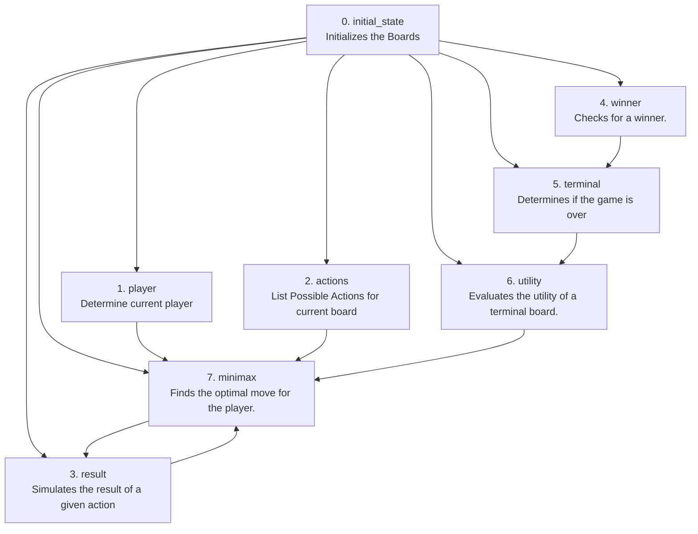

<!-- 
    subgraph Notes
        note1["1. Initializes the board."]
        note2["2. Determines the current player."]
        note3["3. Lists all possible actions for the current board."]
        note4["4. Simulates the result of a move."]
        note5["5. Checks for a winner."]
        note6["6. Determines if the game is over."]
        note7["7. Evaluates the utility of a terminal board."]
        note8["8. Finds the optimal move using the above functions."]
    end
    A -.-> note1
    B -.-> note2
    C -.-> note3
    D -.-> note4
    E -.-> note5
    F -.-> note6
    G -.-> note7
    H -.-> note8 -->